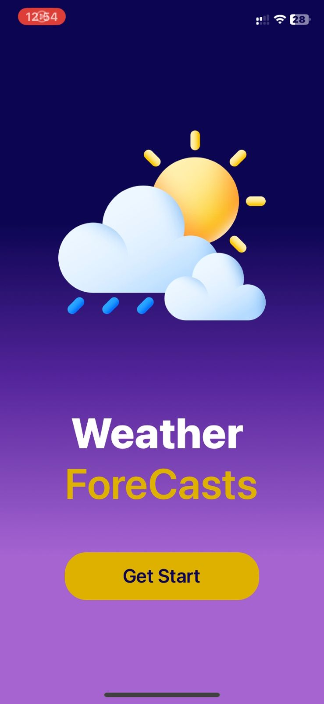
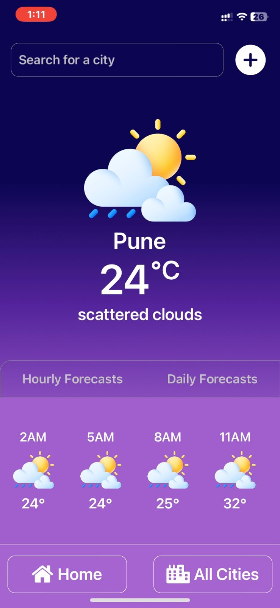
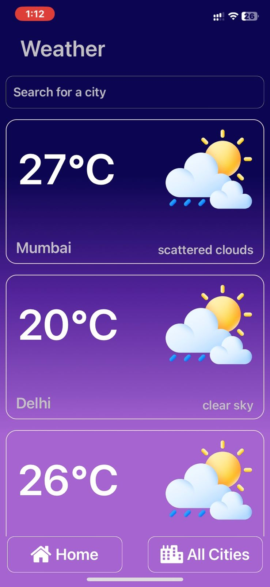

# WeatherForecastApp

#### This is a Weather Forecast application built with Expo and React Native. It utilizes the OpenWeatherAPI to fetch weather data and React Navigation for navigating through the components. Axios is used for making HTTP requests to the OpenWeatherAPI.

## Demo

  
   
  

## Weather App Features:
- City Search:
Users can set the weather for any city by using the search bar.

- Hourly Forecasts:
View the forecast for the current day, with updates every 3 hours.

- Daily Forecasts:
See the weather forecast for the next 5 days.

- Temperature Display:
Check the temperature of any city by simply searching for its name.

## How to Use:
- City Search:
Enter the name of the city you want to check the weather for in the search bar.

- Hourly Forecasts:
Scroll horizontally to view the weather forecast for the current day, with updates every 3 hours.

- Daily Forecasts:
Swipe through the tabs to switch to the "Daily Forecasts" screen and see the weather forecast for the next 5 days.

- Temperature Display:
After searching for a city, the app displays the current temperature along with other weather details.

